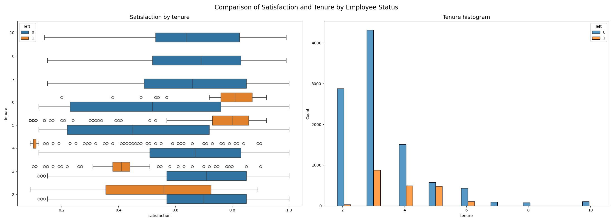

# Google Advanced Data Analytics Professional Certificate Capstone Project

## Overview

This repository contains the implementation for the capstone project of the Google Advanced Data Analytics Professional Certificate available on Coursera.

### Capstone Project: Providing Data-Driven Suggestions for HR

#### Description and Deliverables

This capstone project aims to analyze a dataset and build predictive models to provide insights to the Human Resources (HR) department of a large consulting firm, Salifort Motors.

#### Business Scenario and Problem Statement

The HR department at Salifort Motors seeks to improve employee satisfaction levels and reduce turnover. They collected data from employees but require data-driven suggestions based on this data. The primary question guiding this project is: what factors contribute to an employee leaving the company?

The goals of the project are to analyze the HR dataset and build a predictive model to identify employees likely to leave the company.

#### Stakeholders

1. HR department at Salifort Motors.
2. Company management and executives.

## PACE Stages

### Plan Stage

#### Business Scenario and Problem Understanding

The HR department wants to improve employee satisfaction and reduce turnover.

#### Initial Observations

- Dataset contains 15,000 rows and 10 columns.
- Key factors influencing turnover may include satisfaction level, work-life balance, opportunities for growth, and salary.
- Exploratory data analysis is required to understand relationships between variables.

#### Resources Used

- Kaggle dataset link: [HR Analytics and Job Prediction](https://www.kaggle.com/datasets/mfaisalqureshi/hr-analytics-and-job-prediction?select=HR_comma_sep.csv)
- Python packages: Pandas, NumPy, Matplotlib, Seaborn, Scikit-learn.
- Stack Overflow for troubleshooting.

#### Ethical Considerations

- Maintain confidentiality and comply with data protection regulations.
- Address biases in the dataset or model predictions to avoid unfair treatment of employees.

### Analyze Stage

#### Data Exploration

- Basic information about the data: 10 columns, 15,000 rows.
- Descriptive statistics revealed insights into numerical variables.
- Renamed columns to standardize names.
- Checked for missing values and duplicates.
- Examined outliers in tenure column.

#### Relationships Between Variables

- Explored relationships between average monthly hours, number of projects, and employee turnover.
- Investigated satisfaction levels in relation to working hours and tenure.
- Compared satisfaction and tenure by employee status.
- Calculated mean and median satisfaction scores for employees who stayed versus those who left.
- Analyzed distribution of salary by tenure.

### Data Visualizations

#### Boxplots, Histograms, and Scatterplots

*Figure 1: Distribution of Average Monthly Hours and Number of Projects*

Insights:
- Variation in Work Hours and Project Involvement:
  - Employees who left the company exhibit two distinct patterns:
    - (A) Some worked considerably fewer hours compared to their peers with the same number of projects, possibly indicating termination or resignation with reduced workload.
    - (B) Others worked significantly more hours, likely indicating voluntary resignation of high-contributing employees.
  - Notably, all employees with seven projects left the company, suggesting a possible threshold for workload tolerance.
- Optimal Project Load:
  - Employees engaged in 3-4 projects demonstrate a significantly lower ratio of turnover, implying an optimal workload range.
- Workload Considerations:
  - Most employee groups, including those who remained with the company, surpassed the standard monthly working hours, indicating potential overwork across the organization.

---

*Figure 2: Monthly Hours versus Satisfaction Level by Employee Status*

Insights:
- High Workload and Low Satisfaction:
  - A significant group of employees worked approximately 240-315 hours per month, despite their extensive work hours, their satisfaction levels were close to zero, indicating a potential correlation between high workload and low job satisfaction.
- Normal Work Hours with Moderate Satisfaction:
  - Another group of departing employees had more typical working hours, yet their satisfaction levels hovered around 0.4, potentially due to pressure to work longer hours.
- Moderate Work Hours with Moderate to High Satisfaction:
  - A distinct group worked approximately 210-280 hours per month with satisfaction levels ranging from 0.7 to 0.9, suggesting a positive correlation between manageable work hours and job satisfaction.

---

*Figure 3: Comparison of Satisfaction and Tenure by Employee Status*

Insights:
- Two Distinct Groups of Departing Employees:
  - Employees who left can be divided into two categories: those with short tenures and low satisfaction, and those with medium-length tenures and high satisfaction.
- Concerning Satisfaction Levels for Four-Year Employees:
  - Employees with a four-year tenure exhibited notably low satisfaction levels among those who left, suggesting a potential issue that warrants investigation.
- High Retention among Longest-Tenured Employees:
  - Employees with the longest tenures showed high retention, with satisfaction levels comparable to newer employees who stayed.
- Scarcity of Longer-Tenured Employees:
  - There is a relative scarcity of longer-tenured employees in the dataset, raising questions about the representation of senior or experienced staff.

---

*Figure 4: Distribution of Salary by Tenure*

Insights:
- Salary Distribution Across Tenures:
  - For short-tenured employees, there's no clear pattern indicating a disproportionate presence of higher-paid individuals.
  - Similarly, among long-tenured employees, the distribution of salary levels appears relatively balanced across different tenure lengths.

#### Data Cleaning

- Renamed columns.
- Checked for and handled missing values, duplicates, and outliers.
- Saved the cleaned dataset as CSV for model building.

### PACE: Construct Stage

#### Model Selection

To determine the most appropriate models for predicting employee turnover, logistic regression, random forest classifier, and gradient boosting classifier were considered.

#### Model Construction

- Encoded categorical variables.
- Created dummy variables for the department column.
- Split the dataset into training and testing sets.
- Standardized features for logistic regression.
- Built logistic regression, random forest classifier, and gradient boosting classifier models.
- Fine-tuned model hyperparameters using grid search and cross-validation.

#### Model Evaluation

- Evaluated models' performance using accuracy, precision, recall, F1-score, and area under the ROC curve (AUC).
- Compared performance metrics for logistic regression, random forest classifier, and gradient boosting classifier models.

### PACE: Execute Stage

#### Interpretation of Model Performance

The models' performance metrics provide valuable insights into their effectiveness:

- **Logistic Regression Model:**
    - Precision: 0.48
    - Recall: 0.13
    - F1-Score: 0.21
    - Accuracy: 0.83
    - AUC: 0.55

- **Random Forest Classifier Model:**
    - Precision: 0.98
    - Recall: 0.89
    - F1-Score: 0.93
    - Accuracy: 0.98
    - AUC: 0.94

- **Gradient Boosting Classifier Model:**
    - Precision: 0.97
    - Recall: 0.91
    - F1-Score: 0.94
    - Accuracy: 0.98
    - AUC: 0.95

#### Key Insights

- Gradient Boosting Classifier outperforms both Logistic Regression and Random Forest in terms of AUC score, precision, recall, F1-score, and accuracy. It achieves an AUC score of 0.95, indicating excellent performance in distinguishing between employees who stayed and those who left.
- Random Forest Classifier demonstrates high precision, recall, and F1-score, indicating its effectiveness in identifying employees who left the company. However, its AUC score is slightly lower compared to Gradient Boosting.
- Logistic Regression performs the poorest among the three models, with lower precision, recall, F1

## Conclusion:

The analysis reveals a concerning trend of overworked employees within the company, as indicated by the correlation between various work-related factors and the likelihood of employees leaving.

## Recommendations:

1. **Cap Workload:** Implement a cap on the number of projects employees can handle to prevent burnout and dissatisfaction.

2. **Address Employee Satisfaction:** Investigate and address dissatisfaction among employees, especially those with four years of tenure, through promotions or specific interventions.

3. **Fair Compensation:** Ensure fair compensation or rewards for employees who work longer hours and revisit workload expectations to promote work-life balance.

4. **Transparent Policies:** Clearly communicate company policies regarding overtime pay, workload expectations, and time-off to avoid misunderstandings and dissatisfaction.

5. **Cultural Assessment:** Conduct discussions to understand and address underlying issues contributing to the overworked culture, both company-wide and within teams.

6. **Reconsider Evaluation Criteria:** Review evaluation criteria to ensure they do not solely reward employees who work excessively long hours and consider adopting a more equitable evaluation system.

## Next Steps:

1. **Address Data Leakage Concerns:** Assess model performance without certain features to understand their impact on predictions and mitigate potential data leakage concerns.

2. **Explore Alternative Analyses:** Conduct exploratory analysis, such as predicting performance scores or using clustering analysis, to gain further insights into employee dynamics and retention factors.

Implementation of these recommendations, along with exploring additional analyses, can help improve employee retention, foster a healthier work environment, and enhance organizational success.
